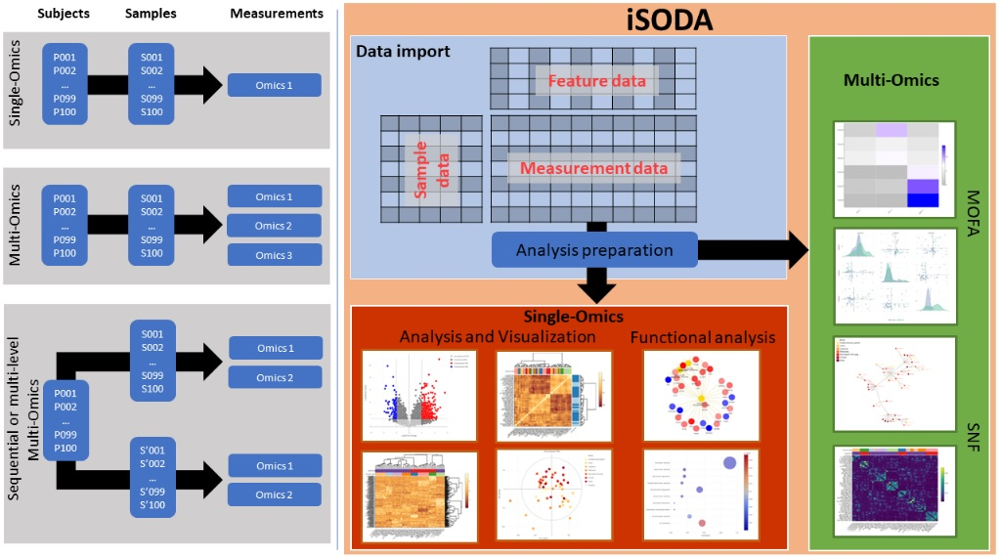

# iSODA: Simple Omics Data Analysis

iSODA, or integrated Simple Omics Data Analysis tool, is a comprehensive online platform designed for the intuitive and in-depth analysis of both single and multi-omics experiments. Central to its design philosophy are modularity, interactivity, and an emphasis on user-driven exploration. Upon uploading their omics datasets, users can delve into a suite of single omics modules that offer capabilities ranging from data visualization to gene set enrichment and over-representation analysis. Each module is equipped with highly interactive plots, ensuring an optimized data exploration experience. For integrated insights from multi-omics experiments, iSODA incorporates MOFA (Multi-Omics Factor Analysis) and SNF (Similarity Network Fusion) methodologies, presenting results through equally interactive visualizations. A standout feature of iSODA is its modular architecture, which not only ensures current robustness in analysis but also paves the way for future expansions

## Features

- **Single omics**: iSODA is as much single omics as it is multi-omics! Import, curate, filter, impute and process your single omics data to ultimately visualize results.
- **Support for Multiple Omics Types**: Currently supports lipidomics, metabolomics, proteomics, transcriptomics, and genomics data.
- **Modular Design**: Upload each single omics experiment into its dedicated module. This allows for independent analysis of multiple single omics experiments. Furthermore, iSODA's modular nature encourages user contributions by making it easier to add functionalities.
- **Interactive Plots**: Each plot in iSODA is made interactable to enhance data exploration and stimulate investigations across modules.
- **Multi-Omics Analysis**: Integrated MOFA (Multi-Omics Factor Analysis) and SNF (Similarity Network Fusion) modules can combine multiple single omics modules, offering deeper insights into the underlying drivers of variations across omics types.

## Getting Started

You can access iSODA online or download it for local usage:

- **Online Version**: [iSODA Web Platform](http://isoda.online/)
- **Download & Setup**: Download the code from this page and run the app locally.

## Tutorials

### Single-omics data upload
https://github.com/user-attachments/assets/cef3de8c-9362-4585-a7ee-155b55132e0c

### Single-omics data visualization  
Once uploaded, the data can be visualized via the multiple available interactive plots. Up to four plots can be displayed simultaneously and the parameters for each plot can be accessed on the associated sidebars. Parameters include:  
- Input settings: tables, samples or feature groups to use
- Data settings: statistics and filtering to apply
- Aesthetic settings: color palettes, marker size, font size
- Output settings: image format, table downloads  

